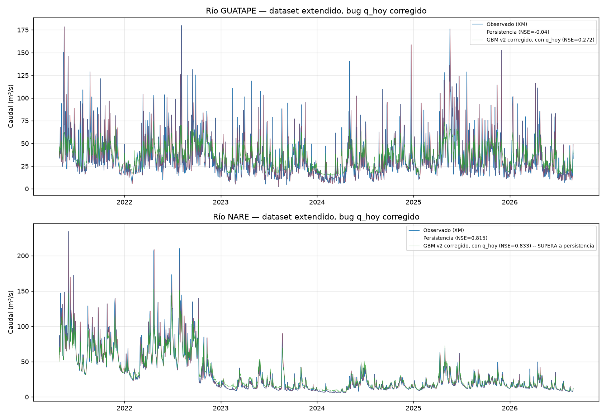

# Bug real: el modelo nunca veía el caudal de HOY para predecir el de MAÑANA

**Encontrado mientras se construía el modelo de picos ([issue #3](https://github.com/wilmerjoseperezorozco-dev/despacho-inteligente-hidrico-solar-colombia/issues/3)), afecta retroactivamente a todos los modelos de Gradient Boosting del proyecto (v1, v2, y todas sus variantes).**

## 1. El bug

`construir_features()` (compartida por `modelo_gbm_caudal.py`, `modelo_gbm_regularizado.py` y `modelo_picos_caudal.py`) construía, para cada fila con fecha D:

- `objetivo_t1` = caudal en D+1 (lo que se predice: "mañana")
- `q_lag1`, `q_lag2`, `q_lag3` = caudal en D-1, D-2, D-3 (ayer, antier, hace 3 días)

**Pero nunca incluía el caudal de la fila D misma (D+0, "hoy") como columna predictora.** El modelo, al intentar predecir el caudal de mañana, solo tenía acceso a ayer y días anteriores — un día completo de rezago innecesario frente a la información realmente disponible al momento de hacer el pronóstico. La persistencia, en cambio, sí usa correctamente el dato de hoy (`Q(t+1) = Q(t)`), lo cual explica en buena parte por qué a los modelos de Gradient Boosting les costaba tanto superarla, especialmente en el río Nare, dominado por autocorrelación.

## 2. Cómo se encontró

No se encontró por inspección de código en abstracto, sino al construir el modelo de picos: al calcular `delta_q = objetivo_t1 - q_lag1` para definir el umbral de evento de crecida, se hizo evidente que `q_lag1` representa el caudal de **ayer**, no de **hoy** — un desfase de un día en la definición del propio evento que llevó a revisar de dónde venía `q_lag1` y a descubrir que "hoy" nunca se había incluido como predictor en ningún lado.

## 3. Corrección

Se agregó `q_hoy = df[objetivo]` (sin desplazar) a `construir_features()` en `modelo_gbm_caudal.py`, y se incluyó en el conjunto de columnas predictoras de los tres scripts afectados. También se corrigió `modelo_picos_caudal.py`, que usaba `q_lag1` como predicción de persistencia (un día atrasada) en vez de `q_hoy`.

## 4. Impacto real, medido — mejora sustancial y en un caso invierte el resultado

Reentrenado sobre el dataset extendido 2000-2026 (mismo período de prueba, 2021-2026), comparando contra los números de `docs/dataset-extendido-2000-2026.md` (que ya quedan superados por este documento):

| Río | Métrica | Antes del fix (con bug) | Después del fix | Persistencia (referencia) |
|---|---|---|---|---|
| Guatapé | NSE | 0,195 | **0,272** | -0,04 |
| Guatapé | Gap train-val | 0,157 | 0,125 | — |
| Nare | NSE | 0,762 (con log1p) | **0,833** (con log1p) | 0,815 |
| Nare | Gap train-val | 0,137 | 0,086 | — |
| Nare | PBIAS | 7,4% | **1,2%** | 0,1% |

**El hallazgo más importante: en Nare, el modelo de Gradient Boosting corregido supera por primera vez en todo el proyecto a la persistencia (0,833 vs. 0,815)** — algo que no se había logrado en ninguna versión anterior (baseline chico, con/sin Riotex, con/sin log, dataset extendido con el bug). En ambos ríos, `q_hoy` resulta ser, con enorme diferencia, la variable más importante por permutación (545,6 en Nare y 138,1 en Guatapé — un orden de magnitud por encima de la siguiente variable), confirmando que el modelo estaba efectivamente ciego a la señal más obvia y predictiva disponible.

## 5. Qué NO cambia con esta corrección

- El diagnóstico de sobreajuste como limitación de datos (`docs/dataset-extendido-2000-2026.md`) sigue siendo válido — el gap train-val bajó aún más con la corrección, reforzando esa conclusión, no contradiciéndola.
- La reversión de la recomendación sobre Riotex (`docs/experimento-sin-riotex.md`) tampoco se ve afectada por este bug específico — es un hallazgo independiente.
- Los documentos históricos (`docs/modelo-gbm-caudal.md`, `docs/modelo-gbm-regularizado-v2.md`, `docs/experimento-sin-riotex.md`, `docs/experimento-log-nare.md`) se conservan íntegros como registro de cómo evolucionó el razonamiento — todos citan resultados obtenidos con el bug presente y deben leerse con esa salvedad.

## 6. Lección metodológica

Este bug estuvo presente desde el primer modelo de Gradient Boosting del proyecto y sobrevivió intacto a través de: la corrección del sobreajuste (validación cruzada temporal), la extensión del dataset 10x, la transformación logarítmica, y el experimento de remover Riotex — ninguno de esos pasos lo habría detectado, porque todos evaluaban el desempeño relativo de configuraciones distintas sin cuestionar si el conjunto base de variables predictoras estaba completo. Se encontró, en cambio, al construir un modelo *distinto* que obligó a mirar con cuidado la semántica exacta de cada variable rezagada. Esto sugiere que revisar la construcción de features desde una perspectiva nueva — no solo ajustar hiperparámetros o probar variaciones del mismo modelo — tiene valor de diagnóstico propio.

## 7. Pendiente

- [ ] Repetir el experimento de remover Riotex (`docs/experimento-sin-riotex.md`) con `q_hoy` ya incluido, para verificar si la conclusión de esa reversión se mantiene.
- [x] ~~Revisar si existen bugs análogos en las variables de precipitación o de las estaciones IDEAM~~ — verificado: `precip_hoy` (`df["chirps_precip_mm"]`, sin desplazar) y `{col}_hoy` de cada estación IDEAM (derivado de la columna sin desplazar, solo con relleno de huecos) sí estaban correctamente definidos desde el inicio. El bug era exclusivo de la variable objetivo (`q_hoy`).
