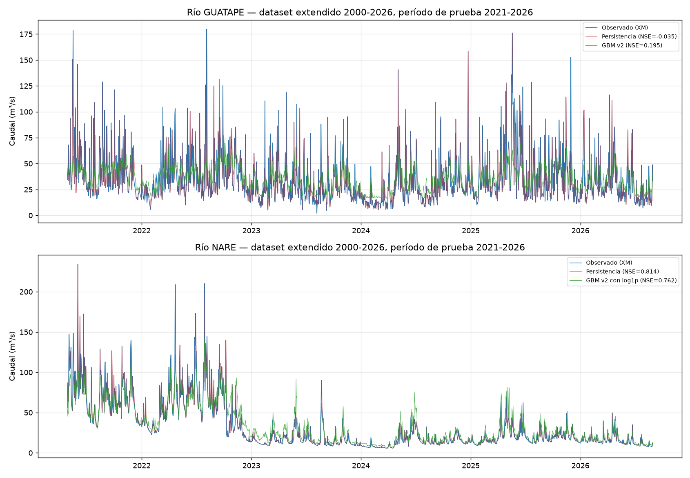

# Dataset extendido 2000-2026 — cierre del issue #1 y actualización completa de resultados

Cierra [issue #1](https://github.com/wilmerjoseperezorozco-dev/despacho-inteligente-hidrico-solar-colombia/issues/1).

## 1. Qué se hizo

Se completó la descarga de CHIRPS diario para 2000-01-01 a 2023-12-31, complementando el rango 2024-2026 ya existente. **Resultado: cobertura del 100%, cero huecos, 2000-01-01 a 2026-08-31 (9.740 días consecutivos)** — verificado explícitamente, no asumido. El dataset consolidado (`data/processed/dataset_fase1_diario.csv`) pasó de 974 a **9.740 filas** (10 veces más datos de entrenamiento).

## 2. Criterio de éxito del issue #1: cumplido

La pregunta que motivó extender el dataset era si el sobreajuste documentado en `docs/modelo-gbm-regularizado-v2.md` (gap train-val de 0,42-0,48 en el dataset corto) bajaría del umbral de 0,3 con más datos. **Se confirma que sí:**

| Río | Gap train-val (dataset corto, 776 días) | Gap train-val (dataset extendido, 7.769 días) |
|---|---|---|
| Guatapé | 0,42 | **0,157** |
| Nare | 0,44-0,48 | **0,12-0,14** |

Esto confirma la conclusión de `docs/modelo-gbm-regularizado-v2.md`: el sobreajuste era una limitación de volumen de datos, no de configuración del modelo — no se cambió nada del código de búsqueda de hiperparámetros, solo el tamaño del dataset de entrada.

## 3. Resultados actualizados — comparación correcta contra el mismo período de prueba

**Importante:** los resultados anteriores (dataset corto) usaban un período de prueba de 2026-02-18 a 2026-08-30 (194-195 días). El dataset extendido usa un período de prueba distinto y mucho más largo, 2021-04-18/28 a 2026-08-30 (~1.943-1.947 días) — los números de esta sección **no son comparables directamente** contra los de `docs/modelo-gbm-caudal.md` o `docs/modelo-gbm-regularizado-v2.md`; sí lo son entre sí dentro de esta sección, porque todos se evaluaron sobre el mismo período extendido.

| Río | Modelo | NSE | KGE | RMSE (m³/s) | PBIAS (%) |
|---|---|---|---|---|---|
| Guatapé | Persistencia | -0,035 | 0,48 | 24,18 | 0,1 |
| Guatapé | Climatología expandida | -0,002 | -0,39 | 23,79 | 3,2 |
| Guatapé | GBM v2 (con Riotex) | **0,195** | 0,22 | 21,42 | 2,9 |
| Guatapé | GBM v2 (sin Riotex) | 0,189 | 0,22 | 21,50 | 1,2 |
| Nare | **Persistencia** | **0,814** | 0,91 | 12,83 | 0,1 |
| Nare | Climatología expandida | -0,278 | -0,22 | 33,65 | 53,2 |
| Nare | GBM v2 (sin log) | 0,710 | 0,72 | 16,07 | 19,7 |
| Nare | GBM v2 (con log1p) | 0,762 | 0,78 | 14,54 | 7,4 |

## 4. Lectura honesta — el panorama se confirma, no se revierte

**Guatapé**: el GBM sigue superando decisivamente a ambos baselines (0,19 frente a -0,035/-0,002), con una brecha incluso más clara que en el dataset corto. Se confirma que este río se beneficia genuinamente de un modelo más rico en predictores.

**Nare**: la persistencia sigue ganando, y con más datos su ventaja es tan o más clara que antes (0,814 frente a 0,762 del mejor GBM). Este es un resultado que se sostiene con 10 veces más datos — no era un artefacto de una muestra pequeña. La transformación logarítmica sigue ayudando de forma real (NSE 0,710→0,762, PBIAS 19,7%→7,4%), pero no alcanza a cerrar la brecha completa.

## 5. Hallazgo metodológico importante: la conclusión sobre Riotex NO se replica con más datos

`docs/experimento-sin-riotex.md` había encontrado, con el dataset corto, que remover la estación IDEAM Riotex mejoraba el NSE de Guatapé de 0,073 a 0,124 (+70%), y advertía explícitamente que esa decisión se había informado con importancia de permutación calculada sobre un período de prueba corto, recomendando no generalizar sin más validación.

**Con el dataset extendido, remover Riotex no ayuda** (NSE 0,195 con Riotex vs. 0,189 sin ella — prácticamente igual, ligeramente peor sin ella) — y en la corrida completa, Riotex aparece con importancia por permutación **positiva** (+4,49), no negativa. Esto confirma que la conclusión anterior era, en efecto, un artefacto del tamaño de muestra pequeño, tal como se advirtió — y valida la disciplina metodológica de documentar esa advertencia en su momento en vez de tratar el hallazgo como definitivo.

**Se mantiene Riotex como predictor en el modelo de Guatapé de aquí en adelante**, revirtiendo la recomendación de `docs/experimento-sin-riotex.md`.

## 6. Comparación visual (5,3 años de período de prueba)

Se aprecia un patrón hidrológico real, no ruido: un período notablemente más húmedo y volátil en 2021-2022 (picos superiores a 200 m³/s en Nare) da paso a un régimen más seco y estable desde 2023 en adelante — consistente con un ciclo de variabilidad climática de varios años (compatible con fases ENSO), y evidencia adicional de por qué evaluar sobre un período de prueba corto (como se hizo en `docs/modelo-gbm-caudal.md`) puede no capturar el comportamiento completo de estos ríos.

## 7. Pendiente

- [ ] Repetir este análisis de sensibilidad (qué variables ayudan/perjudican) directamente con validación cruzada sobre entrenamiento, no con importancia de permutación sobre un solo período de prueba — incluso largo, como se hizo aquí — para evitar depender de un único split cronológico.
- [ ] Investigar por qué el río Nare, con abundante historia y buena autocorrelación, sigue resistiéndose a que un modelo más complejo supere a la persistencia — podría no ser un problema de datos sino de que la persistencia esté genuinamente cerca del límite teórico de predictibilidad de este río específico.
- [ ] Evaluar el modelo de picos extremos (issue #3) ahora sobre el dataset extendido, que incluye muchos más eventos de crecida que el dataset corto.
