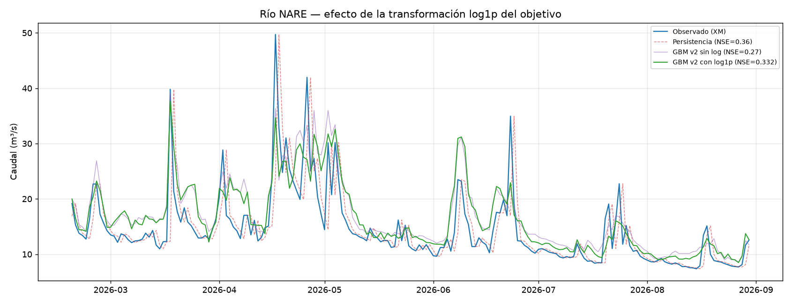

# Experimento: transformación logarítmica del objetivo para NARE

Cierra [issue #2](https://github.com/wilmerjoseperezorozco-dev/despacho-inteligente-hidrico-solar-colombia/issues/2).

## 1. Hipótesis y resultado

`docs/modelo-gbm-regularizado-v2.md` documentó que el modelo GBM de NARE sobreestima sistemáticamente el caudal en períodos de flujo bajo (PBIAS +17,4%), que son la mayoría de los días de la serie. La hipótesis: la distribución de caudal es asimétrica (cola larga hacia crecidas), y ajustar el modelo sobre `log1p(caudal)` en vez del caudal crudo podría reducir ese sesgo.

**Resultado confirmado, mejora real pero parcial:**

| Modelo | NSE | KGE | RMSE (m³/s) | PBIAS (%) |
|---|---|---|---|---|
| Persistencia | **0,36** | 0,68 | 5,16 | 0,3 |
| GBM v2 sin log | 0,272 | 0,66 | 5,53 | 17,4 |
| **GBM v2 con log1p** | **0,332** | 0,66 | 5,30 | **13,9** |

Implementado en [`src/modelo_gbm_regularizado.py`](../src/modelo_gbm_regularizado.py) mediante el flag `--log-objetivo`. El modelo se ajusta en escala `log1p`, pero **todas las métricas se calculan siempre destransformadas (`expm1`) a unidades reales de caudal** — incluyendo el NSE de selección de hiperparámetros y el scoring de importancia por permutación — para que el resultado sea directamente comparable contra las corridas sin transformar.

```
python modelo_gbm_regularizado.py --objetivo xm_nare_m3s --log-objetivo
```

## 2. Lectura honesta

La transformación logarítmica cerró gran parte de la brecha con la persistencia (NSE de 0,272 a 0,332, acercándose al 0,36 de la persistencia) y redujo el sesgo de sobreestimación de forma real (PBIAS de 17,4% a 13,9%). **Pero el modelo sigue sin superar a la persistencia simple.** No se presenta esto como un problema resuelto — es una mejora incremental confirmada, consistente con el patrón ya documentado en este proyecto: NARE es un río donde el baseline simple sigue siendo difícil de superar con los datos actuales.



## 3. Nota sobre el gap de sobreajuste

La búsqueda de hiperparámetros con el objetivo transformado también mostró un gap train-val alto (0,48), consistente con el hallazgo de `docs/modelo-gbm-regularizado-v2.md`: el sobreajuste sigue siendo, ante todo, una limitación de volumen de datos, no algo que la transformación del objetivo por sí sola resuelva.

## 4. Pendiente

- [ ] Repetir este mismo experimento sobre GUATAPE para verificar si la transformación logarítmica también ayuda ahí, dado que ese río tiene una distribución de caudal aún más sesgada por sus pulsos de crecida.
- [ ] Re-evaluar una vez extendido el histórico diario de CHIRPS ([issue #1](https://github.com/wilmerjoseperezorozco-dev/despacho-inteligente-hidrico-solar-colombia/issues/1), en curso) — es posible que con más datos el gap de sobreajuste se cierre y el modelo transformado sí termine superando la persistencia.
