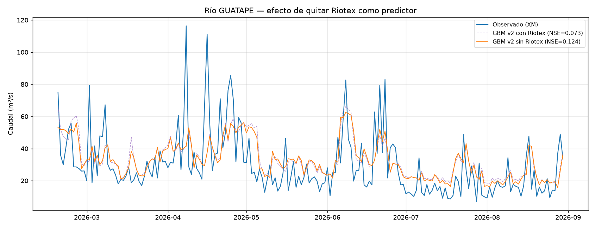

# Experimento: quitar Riotex de GUATAPE — confirmado

## 1. Hipótesis y resultado

`docs/modelo-gbm-regularizado-v2.md` (sección 4) encontró que la estación IDEAM Riotex (`ideam_0023087670_m3s_hoy`, Quebrada La Mosca) tenía importancia por permutación **negativa** (-15,09) en el modelo de GUATAPE — mezclarla al azar mejoraba el resultado. Se probó removerla.

**Resultado confirmado**: el NSE de GUATAPE mejora de **0,073 a 0,124** (+70% relativo) al quitar Riotex del conjunto de predictores. KGE (0,29→0,31), RMSE (17,89→17,39 m³/s) y PBIAS (13,56%→12,52%) también mejoran. Ninguna variable restante muestra una importancia negativa tan marcada como tenía Riotex (la más negativa ahora es `precip_hoy` con -2,99, un orden de magnitud menor).

Ejecutado con:
```
python modelo_gbm_regularizado.py --objetivo xm_guatape_m3s --excluir ideam_0023087670_m3s_hoy ideam_0023087670_m3s_faltante
```

Resultados en `data/processed/gbm_v2_resultados_xm_guatape_m3s_sin_0023087670_0023087670_m3s_faltante.csv`.



La diferencia visual es sutil (las dos curvas casi se superponen la mayor parte del tiempo) — consistente con que la mejora numérica, aunque real, es modesta. No hay que sobrevender esto: es una mejora incremental confirmada, no un cambio de magnitud del modelo.

## 2. Por qué Riotex podría estar perjudicando el modelo (hipótesis, no confirmada)

Riotex mide la Quebrada La Mosca, un tributario más pequeño y geográficamente distinto a los que realmente alimentan el embalse Peñol-Guatapé por el lado del río Guatapé (ver `docs/datos-ideam-caudal.md`). Es posible que su comportamiento hidrológico esté suficientemente desacoplado del río Guatapé como para que el modelo, con pocos datos de entrenamiento, termine ajustando ruido específico de esa estación en vez de señal real. **Esto es una hipótesis razonable, no algo verificado con un análisis hidrológico independiente.**

## 3. Advertencia metodológica importante — no seguir este camino sin cuidado

Esta decisión de quitar una variable se tomó **usando importancia por permutación calculada sobre el propio período de prueba**. Eso es válido para una decisión puntual e informada, pero **repetir este proceso de forma iterativa (quitar la variable con peor importancia, medir en test, repetir)** empezaría a ajustar la selección de variables al test específico — una forma sutil de fuga de información, aunque no se esté tocando el objetivo de entrenamiento directamente. Si se quiere seguir podando variables (`precip_hoy`, `precip_lag3`, `mes_sin`, que también muestran importancia negativa pero mucho menor), **debe hacerse validando la decisión con `TimeSeriesSplit` sobre el período de entrenamiento**, igual que se hizo para los hiperparámetros — no repitiendo este mismo experimento contra el test una y otra vez.

## 4. Estado actualizado de resultados — GUATAPE

| Modelo | NSE | KGE | RMSE (m³/s) | PBIAS (%) |
|---|---|---|---|---|
| Persistencia | -0,10 | 0,45 | 19,70 | 0,4 |
| GBM v1 (sobreajustado) | 0,08 | 0,33 | 17,81 | 13,3 |
| GBM v2 (regularizado, con Riotex) | 0,073 | 0,29 | 17,89 | 13,6 |
| **GBM v2 (regularizado, sin Riotex)** | **0,124** | **0,31** | **17,39** | **12,5** |

## 5. Pendiente

- [ ] Si se justifica seguir podando variables, hacerlo con validación cruzada temporal sobre train, no repitiendo este experimento contra test (ver sección 3).
- [ ] Confirmar o descartar la hipótesis geográfica de la sección 2 con un análisis de correlación cruzada entre Riotex y GUATAPE.
- [ ] La palanca de mayor impacto esperado sigue siendo extender el histórico diario de CHIRPS (ver `docs/dataset-consolidado-fase1.md`), no seguir iterando sobre este mismo conjunto de ~2,7 años.
