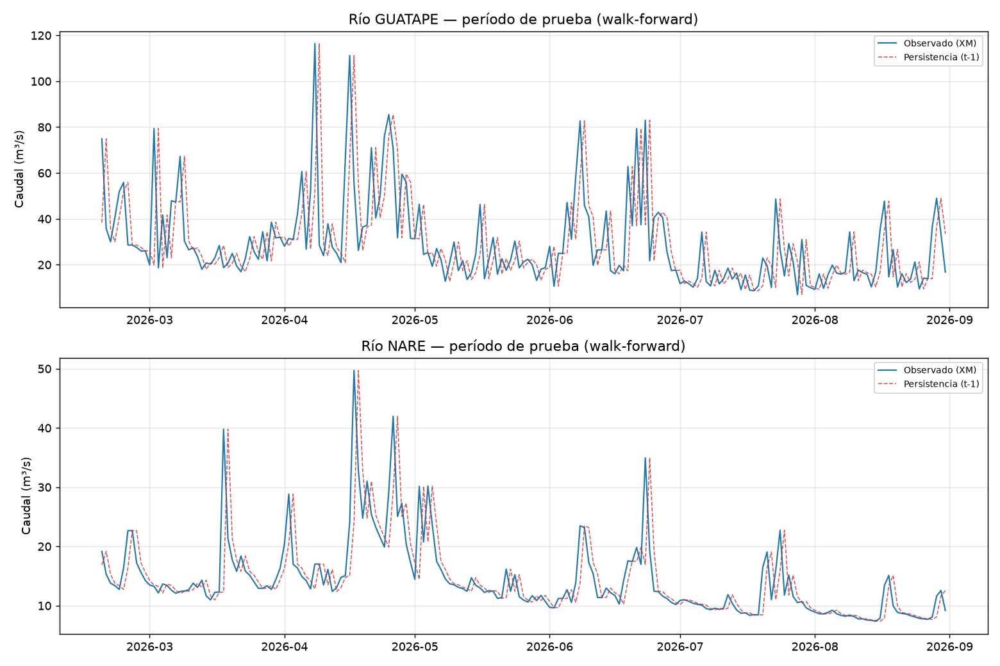

# Modelo baseline de caudal — Fase 2, primer resultado

## 1. Por qué un baseline antes que cualquier modelo de ML

Sin un punto de comparación honesto, no hay forma de saber si un modelo más complejo (LSTM, Gradient Boosting) realmente aporta algo o solo parece funcionar. Esta es la razón de ser de esta etapa — no es un paso decorativo.

Dos baselines evaluados, ambos sin necesidad de entrenamiento complejo:

1. **Persistencia ingenua**: `Q(t+1) = Q(t)` — el caudal de hoy es la predicción de mañana. Estándar en pronóstico de caudal diario por la alta autocorrelación día a día.
2. **Climatología expandida**: `Q(t+1) = media de todos los días anteriores a t` (recalculada cada día, sin ver el futuro).

Implementado en [`src/modelo_baseline_caudal.py`](../src/modelo_baseline_caudal.py) y [`src/metricas_hidrologia.py`](../src/metricas_hidrologia.py) (NSE, KGE + sus 3 componentes, RMSE, MAE, PBIAS — no solo RMSE genérico, ver justificación en `docs/arquitectura-y-benchmarking.md`).

## 2. Validación

Walk-forward con ventana expandida sobre el dataset consolidado de Fase 1 (`data/processed/dataset_fase1_diario.csv`, 974 días). **No se usó split aleatorio** — invalidaría la evaluación en una serie de tiempo. Test = últimos 195 días (2026-02-18 a 2026-08-31), train/ventana expandida = los 779 días anteriores.

## 3. Resultados reales (sin ajustar nada para que se vean mejor)

| Río | Modelo | NSE | KGE | RMSE (m³/s) | MAE (m³/s) | PBIAS (%) |
|---|---|---|---|---|---|---|
| **GUATAPE** | Persistencia | **-0,10** | 0,45 | 19,70 | 13,28 | 0,4 |
| GUATAPE | Climatología expandida | -0,06 | -0,24 | 19,35 | 15,53 | 16,5 |
| **NARE** | Persistencia | **0,36** | 0,68 | 5,16 | 2,76 | 0,3 |
| NARE | Climatología expandida | -0,16 | -0,16 | 6,98 | 5,71 | 19,1 |

Ver [`data/processed/baseline_resultados.csv`](../data/processed/baseline_resultados.csv) (GUATAPE) y [`data/processed/baseline_resultados_nare.csv`](../data/processed/baseline_resultados_nare.csv) (NARE) para las cifras completas, y las predicciones día a día en `data/processed/baseline_predicciones_*.csv`.

## 4. Hallazgo real, investigado antes de reportarlo: GUATAPE y NARE se comportan muy distinto

**NSE negativo en ambos baselines de GUATAPE** — ni la persistencia supera predecir la media del período de prueba. Esto podría parecer un error, así que se investigó antes de aceptarlo:

- Se comparó la volatilidad día a día entre el período de entrenamiento y el de prueba: son consistentes (salto absoluto promedio 14,9 m³/s en train vs. 13,2 en test; 79/779 días con saltos >40 m³/s en train vs. 12/195 en test, proporciones similares). **No es un artefacto del split** — GUATAPE es genuinamente un río con pulsos de crecida abruptos e impredecibles día a día.
- **NARE, en cambio, se comporta como se esperaría** de un baseline de persistencia en hidrología (NSE=0,36, KGE=0,68 — valores respetables para un modelo tan simple).

La imagen confirma esto visualmente — GUATAPE tiene picos angostos y frecuentes que la persistencia (que solo repite el valor de ayer) sistemáticamente llega un día tarde a capturar; NARE tiene picos más suaves y espaciados que la persistencia sigue razonablemente bien:

## 5. Por qué esto importa para el diseño del modelo de Fase 2

- **La climatología pierde contra la persistencia en ambos ríos** — confirma que la persistencia es el baseline correcto a superar, no un promedio histórico.
- **GUATAPE fija una barra muy baja**: cualquier modelo que use precipitación (CHIRPS) como predictor con algún poder de anticipación de los pulsos de crecida ya representaría una mejora real y medible sobre NSE=-0,10.
- **NARE fija una barra más alta** (NSE=0,36): un modelo de ML tendría que superar un baseline que ya es razonablemente bueno — más difícil de mejorar, pero una mejora ahí sería más significativa operativamente.
- Esto sugiere que **GUATAPE es el candidato más prometedor** para demostrar el valor de un modelo con precipitación como predictor (el margen de mejora es mayor), mientras que NARE es un buen caso de control para verificar que el modelo no empeora un baseline ya decente.

## 6. Pendiente

- [ ] Repetir esta evaluación agregando `chirps_precip_mm` con distintos rezagos (1, 2, 3 días) como predictor de un primer modelo de Gradient Boosting, y comparar contra estos baselines.
- [ ] Evaluar si un baseline de persistencia estacional (mismo día del año anterior) tiene sentido una vez se tenga más historia — con solo 2,7 años de dataset diario consolidado no es confiable todavía (ver `docs/dataset-consolidado-fase1.md`).
- [ ] Repetir el análisis de volatilidad (sección 4) sobre las estaciones IDEAM de tributarios, para saber si el patrón "GUATAPE es más flashy que NARE" se explica por una subcuenca específica.
