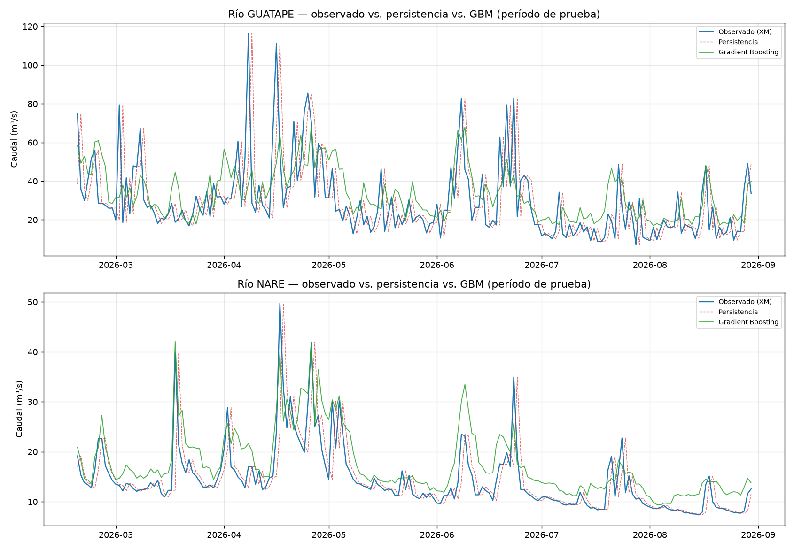

# Primer modelo de Gradient Boosting — resultado mixto y honesto

## 1. Decisión de librería

`requirements.txt` especifica xgboost y lightgbm, pero ninguno estaba instalado en el entorno de esta sesión. Se usó `sklearn.ensemble.GradientBoostingRegressor` — Gradient Boosting genuino, ya disponible, y con la ventaja de exponer `feature_importances_` directamente (a diferencia de `HistGradientBoostingRegressor`). Cambiar a xgboost/lightgbm queda como mejora futura si el desempeño lo justifica — no se instaló una dependencia pesada adicional para un primer prototipo.

## 2. Variables predictoras

Implementado en [`src/modelo_gbm_caudal.py`](../src/modelo_gbm_caudal.py):

- Caudal propio rezagado 1, 2 y 3 días (misma señal que usa la persistencia)
- Precipitación CHIRPS del día actual, rezagada 1-3 días, y acumulada de los últimos 3 días
- Caudal de las 3 estaciones tributarias IDEAM con cobertura usable (se excluye Bodegas, 0% en este rango)
- Estacionalidad (seno/coseno del día del año)

## 3. Hallazgo real corregido antes de evaluar: ventana de test inconsistente

La primera corrida usó `dropna()` sobre todas las columnas predictoras, lo que truncó el período de prueba a 2026-07-31 en vez de 2026-08-31 — porque la estación IDEAM Puente La Feria (Marinilla) **dejó de reportar el último mes** al momento de esta corrida (hallazgo real, no simulado). Esto habría hecho la comparación contra el baseline injusta (ventanas de fechas distintas). Se corrigió imputando los huecos de las estaciones IDEAM (forward-fill acotado a 7 días + mediana de respaldo, con una columna binaria explícita de "dato faltante" para que el modelo pueda distinguir un valor real de uno imputado) en vez de descartar filas completas — decisión también más realista para un sistema pensado para operar: una estación tributaria caída no debería bloquear toda la predicción.

## 4. Resultados reales — comparación directa contra el baseline (mismo período de prueba: 2026-02-18 a 2026-08-30)

| Río | Modelo | NSE | KGE | RMSE (m³/s) | PBIAS (%) |
|---|---|---|---|---|---|
| **GUATAPE** | Persistencia (baseline) | -0,10 | 0,45 | 19,70 | 0,4 |
| **GUATAPE** | **Gradient Boosting** | **0,08** | 0,33 | 17,81 | 13,3 |
| **NARE** | Persistencia (baseline) | **0,36** | 0,68 | 5,16 | 0,3 |
| **NARE** | Gradient Boosting | 0,19 | 0,64 | 5,84 | 22,2 |

Cifras completas y reproducibles en `data/processed/gbm_resultados_xm_guatape_m3s.csv` y `data/processed/gbm_resultados_xm_nare_m3s.csv`.

## 5. El hallazgo central: el modelo mejora en un río y empeora en el otro — se reporta tal cual

**GUATAPE: el GBM sí mejora sobre la persistencia** (NSE de -0,10 a +0,08). Esto confirma la hipótesis planteada en `docs/modelo-baseline-caudal.md`: al ser un río con pulsos de crecida abruptos que la persistencia no puede anticipar, incorporar precipitación como predictor aporta señal real, aunque modesta.

**NARE: el GBM empeora respecto a la persistencia** (NSE de 0,36 a 0,19). El modelo más complejo pierde contra el más simple. Esto no se oculta ni se minimiza — es el resultado real. La causa visible en el gráfico y en el PBIAS (+22,2%, muy superior al 0,3% de persistencia): el GBM sobreestima sistemáticamente durante los períodos de caudal bajo, que son la mayoría de los días en NARE. La persistencia, al copiar literalmente el valor de ayer, no tiene ese sesgo.

## 6. Sobreajuste real, no solo una posibilidad teórica

El propio script detecta y advierte automáticamente: la diferencia NSE train-test supera 0,3 en ambos ríos (GUATAPE: 0,62 train vs. 0,08 test; NARE: 0,89 train vs. 0,19 test). Esto es sobreajuste real — el modelo memoriza patrones del período de entrenamiento (2024-2026, menos de 3 años) que no generalizan. Con un dataset de esta profundidad, es un riesgo esperable, no una sorpresa, pero debe quedar explícito antes de considerar este modelo listo para nada operativo.

## 7. Qué revela la importancia de variables

| Río | Variables dominantes |
|---|---|
| GUATAPE | `q_lag1` (24%), estaciones IDEAM tributarias (24% combinado), `precip_acum3` (9,3%) |
| NARE | Estaciones IDEAM tributarias — Puente Real + Riotex (78% combinado), `q_lag1` apenas 2,8% |

Para NARE, el modelo aprendió a depender casi enteramente de los tributarios IDEAM y casi nada de su propio rezago — lo opuesto a lo que hace bien la persistencia (que solo usa el rezago). Esto es consistente con el resultado: el modelo "abandonó" la señal que mejor funciona para este río a cambio de variables que generalizan peor.

**Ninguna variable de "dato faltante" tuvo importancia real** (todas ~0) — la imputación no introdujo una señal espuria que el modelo aprendiera a explotar, lo cual es una señal positiva sobre la corrección aplicada en la sección 3.

## 8. Limitación real observada en el gráfico: el GBM no puede extrapolar picos extremos

En GUATAPE, los dos picos más grandes del período de prueba (~115 y ~111 m³/s, mediados de abril) son subestimados fuertemente por el GBM (~65 m³/s) mientras que la persistencia, aunque llega un día tarde, sí alcanza la magnitud real una vez el pico ya ocurrió. Esto es una limitación conocida de los árboles de decisión: no pueden predecir valores fuera del rango visto en entrenamiento, solo promedios ponderados de hojas ya observadas. Para los eventos más extremos — que son justamente los que más importan para prevenir vaciados o crecidas — este modelo no es suficiente todavía.

## 9. Conclusión honesta

Este primer modelo de Gradient Boosting **no está listo para reemplazar la persistencia como predicción por defecto**. Su valor real hasta ahora es diagnóstico: confirma que la precipitación sí aporta señal en el río más impredecible (GUATAPE), identifica que el modelo actual tiene sesgo sistemático y sobreajuste, y muestra una limitación estructural (no extrapola picos extremos) que cualquier modelo futuro de esta familia deberá abordar.

## 10. Pendiente

- [ ] Reducir el sobreajuste: menos profundidad de árbol, más regularización, o validación cruzada temporal (walk-forward real con reentrenamiento) en vez de un único split.
- [ ] Corregir el sesgo de sobreestimación en NARE — quizás una variable objetivo transformada (log) ayude, dado que la distribución de caudal es asimétrica.
- [ ] Evaluar un modelo específico para picos (clasificación binaria "¿habrá crecida mañana?" + magnitud condicional) en vez de regresión directa, dada la limitación de extrapolación de la sección 8.
- [ ] Repetir con xgboost/lightgbm una vez haya justificación real de que el enfoque de Gradient Boosting vale la pena frente a alternativas (LSTM u otros).
