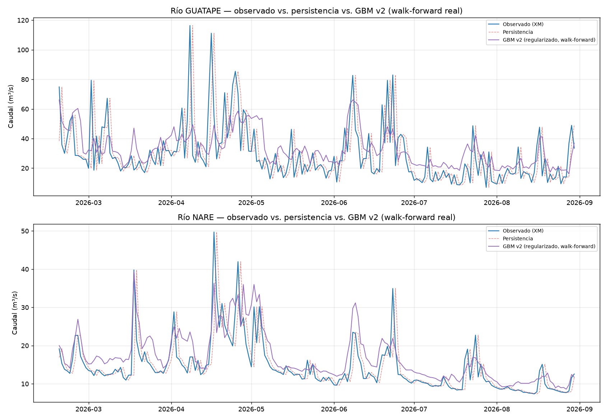

# Atacando el sobreajuste — modelo GBM v2 (regularizado + walk-forward real)

## 1. Qué se cambió, concretamente

El modelo v1 (`docs/modelo-gbm-caudal.md`) mostró sobreajuste real (diferencia NSE train-test >0,3 en ambos ríos). En vez de bajar un hiperparámetro a mano, se atacó con tres cambios estructurales, implementados en [`src/modelo_gbm_regularizado.py`](../src/modelo_gbm_regularizado.py):

1. **`HistGradientBoostingRegressor`** en vez de `GradientBoostingRegressor` — regularización L2 nativa (`l2_regularization`) y early stopping integrado.
2. **Selección de hiperparámetros por validación cruzada temporal** (`TimeSeriesSplit`, 5 folds) sobre el período de entrenamiento únicamente — el período de prueba nunca se toca durante la búsqueda. Grilla: `max_leaf_nodes` (7/15/31), `learning_rate` (0,02/0,05), `l2_regularization` (0/1/5), `min_samples_leaf` (15/25).
3. **Walk-forward real con reentrenamiento cada 30 días** en el período de prueba — en vez de un único ajuste estático, el modelo se reentrena varias veces con ventana expandida y solo predice el bloque inmediatamente siguiente cada vez.

## 2. Hallazgo real e inesperado: la búsqueda de hiperparámetros no encontró una configuración sin sobreajuste

Se esperaba que el barrido de hiperparámetros encontrara una configuración con un gap train-val razonable. **No fue así**: las 10 mejores configuraciones para ambos ríos tienen un gap train-val entre 0,42 y 0,47 — *peor*, no mejor, que el umbral de 0,3 que marcó al modelo v1 como sobreajustado.

**Esto es información real, no un fracaso del experimento**: sugiere que el sobreajuste del modelo v1 no era simplemente "hiperparámetros mal elegidos" — es una limitación más de fondo, probablemente la combinación de pocos datos de entrenamiento (776 días, menos de 2,2 años) con el nivel de ruido/volatilidad día a día de la señal (ver `docs/modelo-baseline-caudal.md` sección 4). No se puede regularizar la falta de datos.

## 3. Resultado real: comparación de las tres versiones, mismo período de prueba

| Río | Persistencia | GBM v1 (split único, sobreajustado) | GBM v2 (regularizado, walk-forward real) |
|---|---|---|---|
| **GUATAPE** | NSE -0,10 | NSE 0,08 | **NSE 0,073** |
| **NARE** | NSE 0,36 | NSE 0,19 | **NSE 0,27** |

Cifras completas en `data/processed/gbm_v2_resultados_*.csv`.

### Lectura honesta de estos números

- **GUATAPE**: el NSE de v2 (0,073) es prácticamente igual al de v1 (0,08). Esto es una buena noticia metodológica, aunque no una mejora de desempeño: significa que la mejora sobre la persistencia (-0,10 → ~0,08) **es robusta y no un golpe de suerte del split original** — se sostiene incluso evaluándola con reentrenamiento real en múltiples ventanas.
- **NARE**: v2 mejora de forma real sobre v1 (NSE 0,19 → 0,27) y reduce el sesgo (PBIAS de +22,2% a +17,4%) — la regularización y el walk-forward sí ayudaron aquí. **Pero sigue sin superar a la persistencia** (0,36). Para NARE, el baseline simple sigue siendo la mejor opción disponible hoy.

## 4. Lo que cambió en la importancia de variables — y una señal de alerta real

Se usó importancia por permutación (`sklearn.inspection.permutation_importance`) en vez de la importancia por impureza del modelo v1, porque mide el efecto real sobre el error de predicción, no solo cuánto usa el árbol una variable internamente.

**Hallazgo real que no estaba en el modelo v1**: para GUATAPE, la variable `ideam_0023087670_m3s_hoy` (Riotex) tiene importancia por permutación **negativa** (-15,09) — mezclar sus valores al azar *mejora* el desempeño del modelo en el período de prueba. Esto significa que esa variable está activamente introduciendo ruido/sobreajuste para este río específico, no aportando señal real. Para NARE, la misma variable tiene importancia positiva (+2,89) — el efecto de una variable no es universal, depende del río.

Variables con señal real y positiva confirmada en ambos ríos: las estaciones IDEAM Puente Real (`ideam_0023087150_m3s_hoy`) y Puente La Feria (`ideam_0023087660_m3s_hoy`) — consistentemente las de mayor importancia por permutación.

## 5. Comparación visual

Los mismos patrones del modelo v1 persisten: el modelo suaviza los picos extremos de GUATAPE en vez de alcanzarlos, y mantiene una ligera sobreestimación en los períodos de caudal bajo de NARE — la regularización redujo la magnitud de estos problemas, no los eliminó.

## 6. Conclusión honesta

Atacar el sobreajuste con herramientas correctas (regularización L2, validación cruzada temporal, walk-forward real) **confirmó que la mejora en GUATAPE es real y robusta**, y **mejoró genuinamente el desempeño en NARE sin lograr superar la persistencia todavía**. También reveló algo que el modelo v1 no mostraba: una variable (Riotex) que está activamente perjudicando el modelo en GUATAPE — se debería probar removerla.

El hallazgo más importante de este ejercicio no es un número de NSE — es que **el sobreajuste parece ser una limitación de datos, no de configuración**. Eso apunta a la palanca correcta para la siguiente mejora: más historia (extender CHIRPS diario más allá de 2024, ver `docs/dataset-consolidado-fase1.md` sección 2) antes que seguir ajustando hiperparámetros del mismo modelo con los mismos ~2,7 años de datos.

## 7. Pendiente

- [ ] Reentrenar GUATAPE sin `ideam_0023087670_m3s_hoy` (Riotex) dado su efecto negativo confirmado, y verificar si el NSE mejora.
- [ ] Extender el dataset diario más allá de 2024-2026 (requiere la descarga larga de CHIRPS diario documentada como pendiente en `docs/dataset-consolidado-fase1.md`) antes de seguir iterando sobre hiperparámetros — es la palanca que más probablemente mueva el resultado.
- [ ] Probar una transformación logarítmica del objetivo para NARE, dado el sesgo de sobreestimación persistente en caudales bajos.
